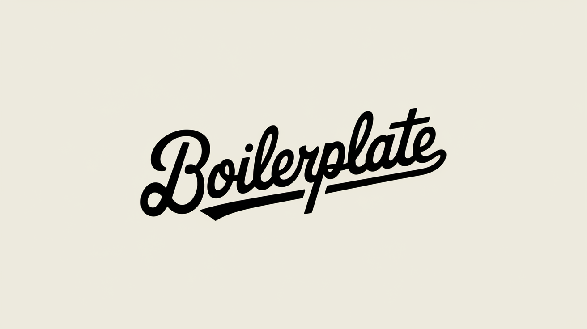
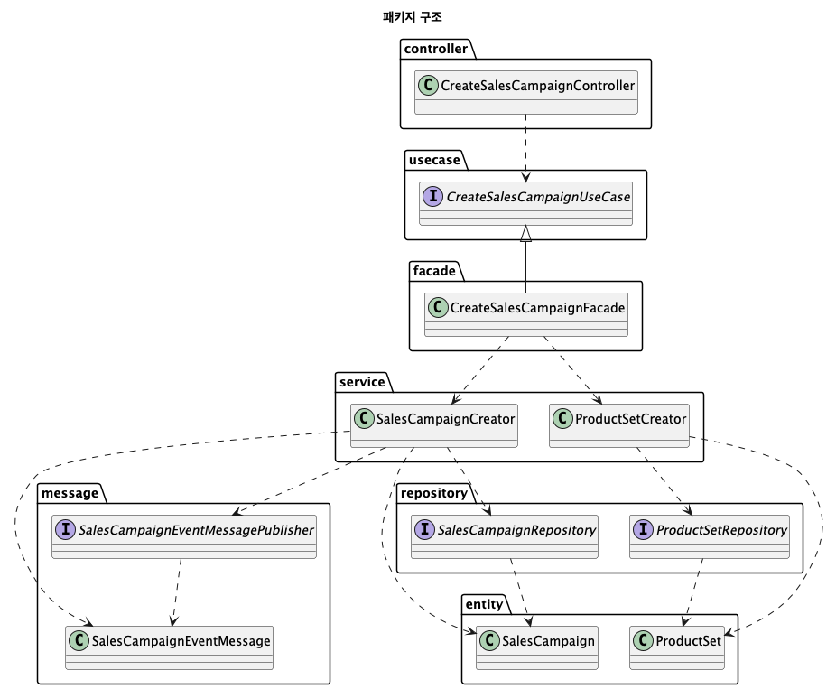

# Boilerplate Project

이 프로젝트는 Spring 애플리케이션 프로젝트를 생성하기 위한 boilerplate 입니다.

## Progress

- [x] 멀티 모듈 구성
- [x] 기본 API 모듈 뼈대 구성
- [x] 기본 Consumer 모듈 뼈대 구성
- [ ] 기본 Batch 모듈 뼈대 구성
- [x] API 표준 응답 포맷 
- [x] API 문서 생성
- [x] DB 연동 설정 (with JPA)
- [x] Kafka 연동 설정
- [ ] Redis 연동 설정 
- [x] 단위 테스트 구성
- [x] 통합 테스트 구성
- [x] 로깅 설정
- [ ] 배포 파이프라인 구성

## Getting Started

### Prerequisites

#### Running Docker Containers 

`local` profile 로 실행하기 위하여 Docker 컨테이너를 실행해주셔야 합니다.

```bash
cd docker
docker-compose up -d
```

Docker Runtime 환경 구성은 아래 링크를 참고해주시기 바랍니다.

- [위키 - 가이드 : Docker](https://wiki.musinsa.com/pages/viewpage.action?pageId=224035657)

### Usage

#### Run Application

```bash
./gradlew :apps:internal-api:bootRun # Internal API
./gradlew :apps:consumer:bootRun # Consumer
```

#### Generate API Documentation

```bash
./gradlew :apps:internal-api:openapi3 # Generate OpenAPI 3.0 Specification
npx @redocly/cli build-docs apps/internal-api/build/api-spec/openapi3.yaml --output=build/openapi/internal-api.html # Generate HTML Documentation
```

## Project Structure

### Modules

```
Root
├── apps (Application)
│   ├── 📦 internal-api (Internal API)
│   ├── 📦 consumer (Consumer)
│   └── 📦 batch (Batch)
└── modules
    ├── 📦 contract (Contract)
    └── 📦 core (Core Business Logic)
```

- `apps` : 애플리케이션 모듈
  - `internal-api` : 내부 API 애플리케이션
  - `consumer` : 메시지 컨슈머 애플리케이션
  - `batch` : 배치 애플리케이션
- `modules` : 라이브러리 모듈
  - `contract` : 공통적으로 사용되는 모델, 인터페이스 등을 정의
  - `core` : 비즈니스 로직을 처리하는 모듈

### Packages

```
Root
├── 📦 internal-api
│   └── 📂 controller
├── 📦 consumer
│   └── 📂 consumer
├── 📦 batch
│   └── 📂 job
├── 📦 core
│   ├── 📂 entity (Entity)
│   ├── 📂 service (Business Service)
│   ├── 📂 facade (Facade, UseCase Implement)
│   ├── 📂 usecase (UseCase)
│   ├── 📂 repository (DAO)
│   ├── 📂 client (Http Client)
│   ├── 📂 message (Message Publisher)
│   ├── 📂 service (Business Service)
│   └── 📂 facade (Facade, UseCase Implement)
└── 📦 contract
    └── 📂 contract
```


